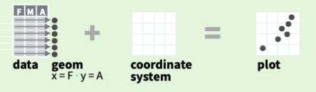
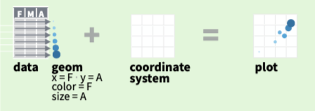

# Introduction to GG, the Grammar of Graphics
`ggplot2` is based on the idea that *any* graph can be build based on three components:

* Data (your raw data input)
* Coordinate System
* Visual marks representing data (called _geoms_)



```{r}
# Loading ggplot2 library
library(ggplot2)
```

`ggplot`s biggest problem is the initial hurdle to get started with it. How on earth are you supposed to create a figure with it? Let us start with a data set (the US Census from 1790-1970) that is already loaded in `R`. Next, let us plot the population size over time.

## Populations Recorded by the US Census 
```{r}
uspop
uspopDF <- data.frame(year=seq(1790,1970,length.out=19), 
                  pop=c(uspop))
ggplot() # an empty canvas
ggplot(data=uspopDF) # data
ggplot(data=uspopDF, mapping=aes(x=year, y=pop)) # adding mapping
ggplot(data=uspopDF, mapping=aes(x=year, y=pop)) + geom_point() # adding geom (for a scatter plot)
ggplot(data=uspopDF, mapping=aes(x=year, y=pop)) + geom_point() + geom_line() #  adding a line plot geom
ggplot(data=uspopDF, mapping=aes(x=year, y=pop)) + geom_point(colour="red") + geom_line() # clouring the dots (dots behin line)
ggplot(data=uspopDF, mapping=aes(x=year, y=pop)) + geom_line() + geom_point(colour="red", size=4) # change size 
```

```{r, warning=FALSE, message=FALSE}
library(cowplot)
theme_set(theme_cowplot())
ggplot(data=uspopDF, mapping=aes(x=year, y=pop)) + geom_point() # adding geom
``` 


The example shows you how we create a figure step by step. Let's try this again with a different data example, the weights of chicken who received different types of diets.

## Weight of chicks on different diets
```{r}
# have a look at what the data looks like
head(chickwts)

# simple plot
ggplot(data=chickwts) +
  geom_point(mapping=aes(x=feed, y=weight))
```

As some of the points are hidden by others and the real distribution might be hard to see, you might want to plot this as a boxplot:

```{r}
ggplot(chickwts) +
  geom_boxplot(aes(x=feed, y=weight))
```

# Subsetting your data and adding dimensions
We can also use ggplot to subset our data to make analysis easier. To do this, we expand the instructions of the mapping, that is, what characteristics of the plot (colour, alpha, size, shape) is mapped to which data.

 

For this we will use another example of chicken weights, but with more information. 

```{r}
head(ChickWeight)

ggplot(ChickWeight) + 
  geom_point(aes(x=Time, y=weight))

# Colour by diet
ggplot(ChickWeight) + 
  geom_point(aes(x=Time, y=weight, colour=Diet))

# Facet by diet
ggplot(ChickWeight) + 
  geom_point(aes(x=Time, y=weight, colour=Diet)) + 
  facet_wrap("Diet")

# Add lines
ggplot(ChickWeight) + 
  geom_point(aes(x=Time, y=weight, colour=Diet)) + 
  geom_line(aes(x=Time, y=weight, colour=Diet)) + 
  facet_wrap("Diet")

# Add grouping
ggplot(ChickWeight) + 
  geom_point(aes(x=Time, y=weight, colour=Diet)) + 
  geom_line(aes(x=Time, y=weight, colour=Diet, group=Chick)) + 
  facet_wrap("Diet")
  
# Use different colour scheme
library(ggsci)
  ggplot(ChickWeight) + 
    geom_point(aes(x=Time, y=weight, colour=Diet)) + 
    geom_line(aes(x=Time, y=weight, colour=Diet, group=Chick)) + 
    facet_wrap("Diet") +
    scale_color_npg()
  
  ggplot(ChickWeight) + 
    # geom_point(aes(x=Time, y=weight, colour=Diet)) + 
    stat_smooth(aes(x=Time, y=weight, colour=Diet)) + 
    # facet_wrap("Diet", nrow=1) +
    scale_color_npg()
```


# Reusing your code
Another great feature of `ggplot` is that you can re-use the same code for different variables in your data set, without having to write the code for the same style of figure over and over again. For that, let's have a look at some flowers:

```{r}
head(iris)

ggplot(iris) + 
  geom_point(aes(x=Sepal.Length, y=Sepal.Width, colour=Species), size=3) +
  theme(legend.position=c(.05,.9))

## Which is identical to:
p <- ggplot(iris, aes(colour=Species)) +
  xlab("Length") +
  ylab("Width") +
  theme(legend.position=c(.05,.85))
p + geom_point(aes(x=Sepal.Length, y=Sepal.Width), size=3) + ggtitle("Sepal")

## And so we can write for Petal
p + geom_point(aes(x=Petal.Length, y=Petal.Width), size=3) + ggtitle("Petal")
```


# Combining plots
It is often useful to combine several plots into a single figure. A package that is especially useful to do this is the `cowplot` package. Let us have a look how to use it: 

```{r}
p <- p + scale_color_npg()
sepalPlot <- p + geom_point(aes(x=Sepal.Length, y=Sepal.Width), size=3)
petalPlot <- p + geom_point(aes(x=Petal.Length, y=Petal.Width), size=3)

plot_grid(sepalPlot, petalPlot)
plot_grid(sepalPlot, petalPlot, labels="AUTO")
plot_grid(sepalPlot+theme(legend.position=""), petalPlot, labels="auto", ncol=1)
```

Another very useful function `cowplot` provides is the save function, which lets you easily save a figures as a PNG or PDF:
```{r}
save_plot(
  plot_grid(sepalPlot, petalPlot, labels="auto", ncol=1),
  filename="~/Desktop/flower_area.pdf", base_height=8, base_width=8
)
```


# Calculations within a ggplot call
Let's calculate the sepal and petal area:
```{r}
ggplot(iris) + 
  geom_point(aes(x=Sepal.Length*Sepal.Width, 
                 y=Petal.Length*Petal.Width, 
                 colour=Species, 
                 shape=Species), size=3) +
  xlab("Sepal area") +
  ylab("Petal area") +
  theme(legend.position=c(.05,.9))
```

# Adding lines and regressions
```{r}
ggplot(iris, aes(x=Sepal.Length*Sepal.Width, y=Petal.Length*Petal.Width, colour=Species, shape=Species)) + 
  geom_point(size=3) +
  geom_vline(xintercept=20, linetype=2, colour="grey") +
  geom_hline(aes(yintercept=median(Petal.Length*Petal.Width)), linetype=3, colour="darkred") +
  xlab("Sepal area") +
  ylab("Petal area") +
  theme(legend.position=c(.05,.9))

ggplot(iris, aes(x=Sepal.Length*Sepal.Width, y=Petal.Length*Petal.Width, colour=Species, shape=Species)) + 
  geom_point(size=3) +
  geom_smooth(method="lm") +
  xlab("Sepal area") +
  ylab("Petal area") +
  theme(legend.position=c(.05,.9))
```

# Addinig regression from a linear model manually
```{r}
out <- lm(data=iris, formula= Petal.Width ~ Petal.Length)
out$coefficients[1]
out$coefficients[2]
petalPlot + geom_abline(intercept=out$coefficients[1], slope=out$coefficients[2])

# which is identical to:
petalPlot + stat_smooth(aes(x=Petal.Length, y=Petal.Width), col="black", method="lm", se=F)
```

# Changing colour themes 
Chanding up colours using the Brewer palettes
```{r}
sepalPlot + scale_color_brewer(palette="Reds")
```

For printing you sometimes need a grey scale:
```{r}
sepalPlot + scale_color_grey()
```


# Plotting your own data

```{r}
df <- data.frame(x=runif(100, -1, 5),
           y=rnorm(100, 5, 2), 
           type=sample(c("a","b"), 100, replace=T))

ggplot(df) + geom_point(aes(x=x, y=y, col=type))
```


<!--
## Example of a figure from my pulbications
```{r Density plot for coupled pnpr with random enforcement of degree, eval=FALSE}
library(dplyr)
library(reshape2)
# library(ggplot2)
# library(cowplot); theme_set(theme_cowplot())
# library(ggsci)

folder <- "/Users/marco/Documents/Programming/julia/marcosProjects/culturegroup/results/180814_coupling_pnpr_randomEnforcement/" #LS44PGD

load(paste(folder, "180814_coupling_pnpr_randomEnforcement_summary", sep="")) #LS44PGD

data <- as.data.frame(pnpr2_data)
data$payoffMethod <- factor(data$payoffMethod, 
                            levels=c(1,4), 
                            labels=c("repertoire","proficiency"))
data$k <- factor(data$k, 
                 levels=c(2,6,10), 
                 labels=c("k=2","k=6","k=10"))

lapply(c("k=2","k=6","k=10"), function(x){
  tmp <- lm(data$recPN[data$k==x]~data$recPR[data$k==x])
  data.frame(i=tmp$coefficient[1], s=tmp$coefficient[2], row.names=NULL)
}) %>% bind_rows() -> lmres

q <- ggplot(data=data, aes(colour=payoffMethod, shape=k)) + 
  scale_color_aaas() + 
  theme(legend.title=element_blank(), axis.line=element_blank()) + 
  scale_shape_manual(values=c(17,0,20)) + 
  panel_border(size=1, colour="black")

p1 <-q + 
  geom_abline(aes(intercept=lmres$i[1], slope=lmres$s[1]), alpha=.3) +
  geom_abline(aes(intercept=lmres$i[2], slope=lmres$s[2]), alpha=.3) +
  geom_abline(aes(intercept=lmres$i[3], slope=lmres$s[3]), alpha=.3) +
  geom_point(aes(x=recPR, y=recPN), alpha=.75, size=2) + 
  labs(y=expression(p[n]), x=expression(p[r])) + 
  theme(legend.position="")

p2 <- q + 
  geom_point(aes(y=path, x=k), position=position_dodge(width=0.3), size=2) + 
  labs(x="Degree", y="Average path length") + 
  theme(legend.position="")

p3 <- q + 
  geom_point(aes(x=recMedNTraits, y=recMedMaxTraitLevel), alpha=.75, size=2) + 
  labs(y="Mean highest proficiency", x="Average repertoire size") + 
  theme(legend.position=c(.62,.8), 
        legend.text=element_text(size=9), 
        legend.spacing.y=unit(-2,"mm")) + 
  scale_x_continuous(limits=c(4.6,6), breaks=c(5,5.5,6), labels=c("5","","6"))

plot_grid(p1,p2,p3, labels=LETTERS[1:3], nrow=1)

# save_plot(plot_grid(p1,p2,p3, labels=LETTERS[1:3], nrow=1), filename=paste(folder,"180814_coupling_pnpr_randomEnforcement_LS44PGD.pdf",sep=""), base_height=3.5, base_width=10)
```
-->


# More Resources
* [ggplot2 cheat sheets](https://github.com/rstudio/cheatsheets/blob/master/data-visualization-2.1.pdf)

* for better colour scales have a look at the `viridis` [package](https://cran.r-project.org/web/packages/viridis/vignettes/intro-to-viridis.html)

* More on `cowplot` see [the CRAN page](https://cran.r-project.org/web/packages/cowplot/vignettes/introduction.html) and another [example on github](https://github.com/marcosmolla/Cowplot_Publishable_Figures)

* To create documents like this have a look at RStudio's [RMarkdown explainer](https://rmarkdown.rstudio.com/lesson-1.html)

* A gallery of [RMarkdown themes](http://www.datadreaming.org/post/r-markdown-theme-gallery/)

* This document uses the 'leonids' theme of the `prettydoc` package. For more information visit the [development page](http://github.com/yixuan/prettydoc/)
